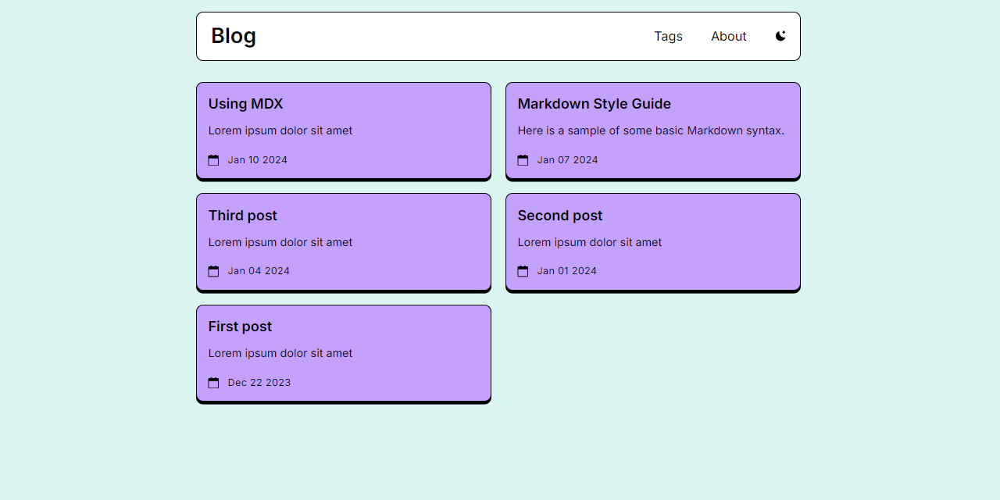

<<<<<<< HEAD


# Blog

Blog is a neobrutalism-styled astro tailwind template for blogs.

## Get started

[Create a new repo](https://github.com/neobrutalism-templates/blog/generate) from this template.

### Installation

This template uses `pnpm` package manager so make sure you have it installed.

To install all dependencies run:

```bash
pnpm i
```

To run the app locally:

```bash
pnpm run dev
```

### Config

- Go to `astro.config.mjs` and change site
- Go to `src/config.ts` and configure data for meta tags
- You can customize code blocks config by changing `expressiveCode` object in astro config. Visit [expressive-code docs](https://expressive-code.com/reference/configuration) for more info.
- To change code blocks theme, you'll have to update themes both in `themes` array and in `config.ts`

### How to add new post

Create a new md/mdx file inside src/content/posts, and make sure it's in this format:

```
---
title: 'First post'
description: 'Lorem ipsum dolor sit amet'
pubDate: 'Dec 22 2023'
tags: ['astro', 'blogging', 'learning']
---

Your post
```

### Styling

To change the styling visit [styling docs](https://neobrutalism-components.vercel.app/docs/styling), and copy the desired styling to tailwind config like it's shown in the styling docs.

Make sure to not delete `fontFamily`, `screens`, and `typography` from tailwind config.

After you change the font weight you'll have to update font imports inside `src/layouts/Base.astro`.
=======
# thedev.id

An identity for developers on the web.

## What is thedev.id

**thedev.id** is a free identity for developers on the web. This service offers a handy subdomain like `foo.thedev.id` or `bar.thedev.id` for use on your static sites via [CNAME record](https://en.wikipedia.org/wiki/CNAME_record). Fork, add subdomain and send a Pull Request. We will make it work.

## How to get one

- Star this repo.
- Fork this repo.
- Set a custom domain to your [GitHub Pages](https://pages.github.com).
- Add your subdomain under `subdomains.json` file.
- Run `npm install` and `npm run sort` to sort the keys alphabetically.
- Send Pull Request.

### Similar Services
- [Open Domains](https://github.com/open-domains/register)
- [cluster.ws & wip.la](https://github.com/Olivr/free-domain)
- [is-a.dev](https://github.com/is-a-dev/register)
- [is-a-good.dev](https://github.com/is-a-good-dev/register)
- [is-really.cool](https://github.com/is-really-cool/register)
- [js.org](https://github.com/js-org/js.org) (*JavaScript projects only*)
- [merahputih.moe](https://github.com/ScathachGrip/merahputih.moe)
>>>>>>> ddc9297fd9c7375547c33b0f129ad068f6462274
